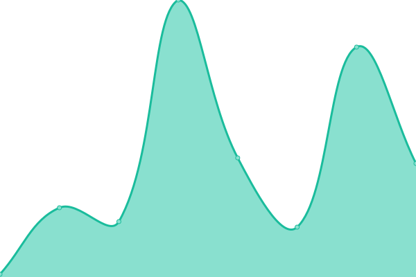
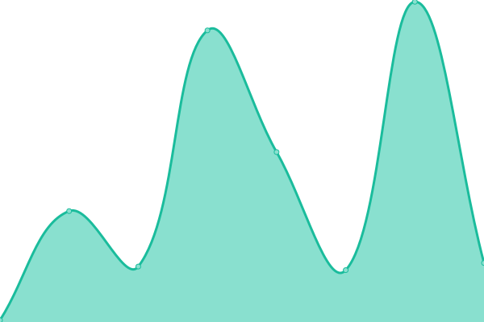

# [📈 Live Status](https://status.ideaape.com): <!--live status--> **🟩 All systems operational**

This repository contains the open-source uptime monitor and status page for [Kenny](https://elapse.ai), powered by [Upptime](https://github.com/upptime/upptime).

With [Upptime](https://upptime.js.org), you can get your own unlimited and free uptime monitor and status page, powered entirely by a GitHub repository. We use [Issues](https://github.com/kdcokenny/ideaape-status/issues) as incident reports, [Actions](https://github.com/kdcokenny/ideaape-status/actions) as uptime monitors, and [Pages](https://status.ideaape.com) for the status page.

<!--start: status pages-->
<!-- This summary is generated by Upptime (https://github.com/upptime/upptime) -->
<!-- Do not edit this manually, your changes will be overwritten -->
<!-- prettier-ignore -->
| URL | Status | History | Response Time | Uptime |
| --- | ------ | ------- | ------------- | ------ |
|  [IdeaApe](https://ideaape.com) | 🟩 Up | [idea-ape.yml](https://github.com/kdcokenny/idea-ape-status/commits/HEAD/history/idea-ape.yml) | 

 1285ms
     
 | 

<a href="https://status.ideaape.com/history/idea-ape">91.42%</a>
    

|  [IdeaApe Dashboard](https://ideaape.com/dashboard) | 🟩 Up | [idea-ape-dashboard.yml](https://github.com/kdcokenny/idea-ape-status/commits/HEAD/history/idea-ape-dashboard.yml) | 

 210ms
     
 | 

<a href="https://status.ideaape.com/history/idea-ape-dashboard">91.06%</a>
    

|  [IdeaApe Auth](https://ideaape.com/auth/continue) | 🟩 Up | [idea-ape-auth.yml](https://github.com/kdcokenny/idea-ape-status/commits/HEAD/history/idea-ape-auth.yml) | 

 98ms
     
 | 

<a href="https://status.ideaape.com/history/idea-ape-auth">91.25%</a>
    

|  [IdeaApe Market Research](https://ideaape.com/market-research) | 🟩 Up | [idea-ape-market-research.yml](https://github.com/kdcokenny/idea-ape-status/commits/HEAD/history/idea-ape-market-research.yml) | 

 153ms
     
 | 

<a href="https://status.ideaape.com/history/idea-ape-market-research">91.29%</a>
    

|  [IdeaApe Business](https://ideaape.com/business) | 🟩 Up | [idea-ape-business.yml](https://github.com/kdcokenny/idea-ape-status/commits/HEAD/history/idea-ape-business.yml) | 

 179ms
     
 | 

<a href="https://status.ideaape.com/history/idea-ape-business">91.35%</a>
    

|  [IdeaApe API](https://ideaape.com/api) | 🟩 Up | [idea-ape-api.yml](https://github.com/kdcokenny/idea-ape-status/commits/HEAD/history/idea-ape-api.yml) | 

 47ms
     
 | 

<a href="https://status.ideaape.com/history/idea-ape-api">91.71%</a>
    

<!--end: status pages-->

[**Visit our status website →**](https://status.ideaape.com)

## 📄 License

- Powered by: [Upptime](https://github.com/upptime/upptime)
- Code: [MIT](./LICENSE) © [Anand Chowdhary](https://anandchowdhary.com), supported by [Pabio](https://pabio.com)
- Data in the `./history` directory: [Open Database License](https://opendatacommons.org/licenses/odbl/1-0/)
